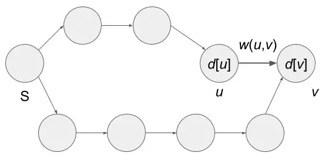
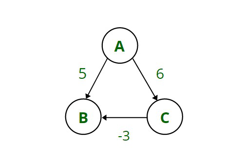
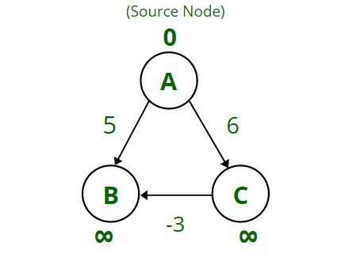
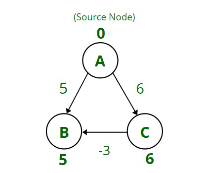

### Introduction

#### Dijkstra算法简介

##### 概述

* Dijkstra算法是一种图搜索算法，旨在寻找图中节点之间的最短路径，也是一种求解单源最短路径问题的贪心算法[<sup>[1]</sup>](#refer-anchor-1)。它解决具有非负边路径成本的图的单源最短路径问题，生成最短路径树。由Edsger Dijkstra 构想。

##### 算法条件

* 有向图和无向图

* 所有边都必须具有非负权重
 
* 图必须连接

##### 算法思想

* Dijkstra算法基于松弛(Relaxation)的概念：边缘松弛(Edge Relaxation)和顶点松弛(Vertex Relaxation)。边缘松弛实际上是顶点松弛的一部分。

* **边缘松弛**：例如，一条有向边连接顶点u和顶点v并且从u到v，这意味着这是顶点v的入站边。边缘松弛是为了找出当前考虑的入站边是否有助于从源到顶点v的距离比现在更短。*这个距离是怎么计算的呢？* 一般来说，如果有一条路径从源顶点(起始顶点)到顶点v，经过顶点u，那么从源到v的距离=从源到顶点u的距离+从u到v的距离。

  + 对于顶点u到顶点v的边，如果满足$d[u]+w(u,v)<d[v]$，更新$d[v]$为$d[u]+w(u,v)$

    - 顶点u和v代表图中的邻居，$d[u]$和$d[v]$分别代表到顶点u和v的到达成本。

    - $w (u,v)$表示从顶点u到顶点v的边的权重。
  
  + <div align=center>
      
        <center><p>图1 </p></center>
    </div>

    - 当前已知可以从起始顶点S通过两个顶点到达顶点u并且该路径花费$d[u]$。此外，我们可以从起始顶点$S$通过四个顶点到达顶点v并且该路径花费$d[v]$。

    - 当$d[u]+w(u,v)<d[v]$ 时，边缘松弛将$d[v]$更新为$d[u]+w(u,v)$。换句话说，它将当前到达顶点$v(d[v])$的到达成本更新为较低的到达成本$(d[u]+w(u,v))$。它更新成本的原因是通过顶点的路径u可以更短，因为通过顶点u的路径的到达成本将低于当前路径的成本。
    
    - **实际上，最短路径问题的算法通过反复使用边缘松弛来解决问题。**

##### 算法过程

* 将开始的节点称为初始节点。令节点Y的距离为初始节点到Y的距离。Dijkstra算法会分配一些初始距离值，并会尝试逐步改进它们。

  + 1）为每个节点分配一个暂定距离值：对于我们的初始节点将其设置为零，对于所有其他节点将其设置为无穷大。
  
  + 2）标记所有未访问的节点。将初始节点设置为当前节点。创建一组未访问的节点，称为由所有节点组成的未访问集。

  + 3）对于当前节点，考虑其所有未访问的邻居并计算它们的暂定距离。例如，如果当前节点A 的标记距离为6，并且连接它与邻居B的边的长度为 2，则到B（通过 A）的距离将为6+2=8。
  
  + 4）当我们完成对当前节点的所有邻居的考虑后，将当前节点标记为已访问并将其从未访问集中删除。永远不会再次检查已访问的节点。
  
  + 5）如果目的节点已被标记为已访问（规划两个特定节点之间的路径时）或未访问集中节点之间的最小暂定距离为无穷大（规划完整遍历时；发生在初始节点之间没有连接时）和剩余未访问的节点），然后停止。算法已经完成。
  
  + 6）选择标记为最小暂定距离的未访问节点，并将其设置为新的“当前节点”，然后返回步骤 3。 

* 下列图显示了使用Dijkstras算法从节点“a”或“1”到节点“b”或“5”的最短路径。访问过的节点将显示为红色。将会看到最短路径是以最小成本 20 遍历节点1、3、6、5。

  + **目标定义**：给定一个有向图$\mathbf{G={\{N, E\}}}$，其中$\mathbf{N}$是$\mathbf{G}$的节点集合，$\mathbf{E}$是有向边的集合，每条边都有一个非负长度，也可以定义为权重或成本，这些节点中有一个节点被视为源节点。
  
  + **问题定义**：确定从原点到每个节点的最小路径长度。Dijkstra算法使用两组节点$\mathbf{S}$和$\mathbf{C}$，集合$\mathbf{S}$包含选定节点的集合以及给定时间每个节点到原始节点的距离。

    - 集合$\mathbf{P}$包含所有尚未被选中且距离未知的候选节点。因此节点集合等于选中节点集和未选中节点集的并集，由此推导出不变属性$\mathbf{N=S \cup C}$

    - 在算法的第一步中，集合$\mathbf{S}$只有节点原点，当算法完成时，它包含所有图节点以及每条边的成本。

    - 如果从原点到它的路径中涉及的所有节点都在选定节点集合$\mathbf{S}$ 内，则考虑一个特殊节点。Dijkstra算法维护一个矩阵$\mathbf{D}$，该矩阵在每一步都使用最短特殊路径的长度或权重进行更新集合$\mathbf{S}$ 的每个节点。

     - 当一个新的$\mathbf{v}$节点试图被添加到$\mathbf{S}$时，到$\mathbf{v}$的最短特殊路径也是到所有其他节点的最短路径。算法完成后，所有节点都在$\mathbf{S}$中，矩阵$\mathbf{D}$包含从原点到图中任何其他节点的所有特殊路径，从而解决了最小路径问题。
     
  + **算法目标**：计算从集合$\mathbf{S}$中的节点"1"到节点“5”的最短路径；

      - **步骤一**：从图$\mathbf{N}$中节点“1”开始；
        <div align=center>
            
            <center><p>图1  </p></center>
        </div>

      - **步骤二**：采用广度优先策略从节点“1”的邻接节点$\mathbf{E}$中遍历最短路径；
        <div align=center>
            
            <center><p>图2 </p></center>
        </div>

      - **步骤三**：获取到节点“2”的最短路径7，更新集合$\mathbf{S}$中到节点“2”最短路径长度为7；
        <div align=center>
            
            <center><p>图3 </p></center>
        </div>

      - **步骤四**：采用广度优先策略从节点“1”的邻接节点$\mathbf{E}$中遍历最短路径；
        <div align=center>
            
            <center><p>图4 </p></center>
        </div>

      - **步骤五**：获取到节点“3”的最短路径9，更新集合$\mathbf{S}$中到节点“3”最短路径长度为9；
        <div align=center>
            
            <center><p>图5 </p></center>
        </div>

      - **步骤六**：采用广度优先策略从节点“1”的邻接节点$\mathbf{E}$中遍历最短路径；
        <div align=center>
            
            <center><p>图6 </p></center>
        </div>

      - **步骤七**：获取到节点“6”的最短路径14，更新集合$\mathbf{S}$中到节点“6”最短路径长度为14；
        <div align=center>
            
            <center><p>图7 </p></center>
        </div>

      - **步骤八**：更新节点向量S，向量值表示到该节点的距离，并把节点一移出集合$\mathbf{P}$；
        <div align=center>
            
            <center><p>图8 </p></center>
        </div>

      - **步骤九**：结束节点”1“的遍历，接下来从集合$\mathbf{P}$中选择节点“2”开始遍历；
        <div align=center>
            
            <center><p>图9 </p></center>
        </div>

      - **步骤十**：从节点“2”的邻接节点中$\mathbf{E}$遍历到节点“3”，发现到节点“3“的距离7+10=17大于向量S中节点”3“的最短距离9；
        <div align=center>
            
            <center><p>图10 </p></center>
        </div>


      - **步骤十一**：因此在向量$\mathbf{S}$中不更新节点”3“的最短距离；
        <div align=center>
            
            <center><p>图11 </p></center>
        </div>


      - **步骤十二**：接着从节点”2“的$\mathbf{E}$集合进行遍历，遍历到节点”4“；
        <div align=center>
            
            <center><p>图12 </p></center>
        </div>

      - **步骤十三**：更新到节点”4“的最短距离7+15=22，更新向量$\mathbf{S}$；
        <div align=center>
            
            <center><p>图13 </p></center>
        </div>

      - **步骤十四**：结束从节点”2“开始的遍历，将节点”2“移出集合$\mathbf{P}$；
        <div align=center>
            
            <center><p>图14 </p></center>
        </div>

      - **步骤十五**：递归，从节点”1“的$\mathbf{E}$开始广度遍历，从节点”3“开始遍历；
        <div align=center>
            
            <center><p>图15 </p></center>
        </div>
      - **步骤十六**：从节点”3“开始遍历，遍历到节点”4“
        <div align=center>
            
            <center><p>图16 </p></center>
        </div>
     - **步骤十七**：获得到节点”4“的最短距离9+11=20，小于之前的最短距离22，所以更新到节点”4“的最短距离为20；
        <div align=center>
            
            <center><p>图17 </p></center>
        </div>

     - **步骤十八**：遍历到节点”6“；
        <div align=center>
            
            <center><p>图18 </p></center>
        </div>

     - **步骤十九**：获得到节点”6“的最短距离9+2=11，小于之前的最短距离14，所以更新到节点”6“的最短距离为11；
        <div align=center>
            
            <center><p>图19 </p></center>
        </div>

     - **步骤二十**：结束从节点”3“开始的遍历，将节点”3“移出集合$\mathbf{P}$；
        <div align=center>
            
            <center><p>图20 </p></center>
        </div>
    
     - **步骤二十一**：从节点”6“开始遍历，获得到节点”5“的最短路径
        <div align=center>
            
            <center><p>图21 </p></center>
        </div>

     - **步骤二十二**：到节点”5“的最短路径11+9=20，更新向量$\mathbf{S}$中的到节点”5“的最短距离
        <div align=center>
            
            <center><p>图22 </p></center>
        </div>

     - **步骤二十三**：结束从节点"6"开始的遍历，将节点"6"移出集合$\mathbf{P}$；
        <div align=center>
            
            <center><p>图23 </p></center>
        </div>

     - **步骤二十四**：从节点"4"开始的遍历，到节点"5"的最短路径为20+6=26，故有20(4)>=20(5)，无需更新向量$\mathbf{S}$。
        <div align=center>
            
            <center><p>图24 </p></center>
        </div>

* **算法思路**：
    + 广度优先；
    + 松弛；

##### 伪代码

* Dijkstra算法伪代码为[<sup>[2]</sup>](#refer-anchor-2)：

``` python
function Dijkstra(L[1..n, 1..n]): matrix [2..n]
matrix D[2..n]
{initialization}
C <- {2, 3, …, n} {S = N \ C exists only implicitly}
for i ← 2 to n do D[i] ← L[1, i]
{greedy loop}
repeat n - 2 times
    v ← some element of C that minimizes D[v]
	  C ← C \ {v} {and implicitly S ←  S U {v}}
	  for each w ∈ C do
		  D[w] ← min(D[w], D[v] + L[v, w])
Return D
```

##### 算法时间复杂度

* 初始化需要一个矩阵$L[1..n, 1..n]$，因此需要一个$\mathbf{O(n)}$的时间。

* `repeat`循环需要遍历C的所有元素，所以总时间为$\mathbf{O(n^2)}$ 

* `each`的循环需要遍历C的所有元素，因此总时间约为$\mathbf{n^2}$，因此，Dijkstra算法的简单实现需要一个运行时是$\mathbf{O(n^2)}$

* 取决于算法的实现，只要边数远小于$\mathbf{n^2}$，如果图是连通的并且在$\mathbf {O(alogn)}$中，我们可以将复杂度提高到$\mathbf{O((a+n)logn)}$，如果图是稠密图的话，则复杂度最高为$\mathbf{O(log \frac{n^2}{logn})}$

#### 其他

***为什么Dijkstra算法对于负权重会失效？***

* Dijkstra算法不适用于具有负距离的图。负距离会导致算法无限循环，必须由专门的算法处理，例如Bellman-Ford算法或 Johnson 算法[<sup>[3]</sup>](#refer-anchor-3)，其可以在遇到负循环时停止循环。

* **示例**：考虑具有节点A、B和C的循环有向图，这些节点由具有表示使用该边的成本的权重的边连接[<sup>[4]</sup>](#refer-anchor-4)。以下是图25中提到的权重：
  + A–>B=5，A–>C=6，C–>B=-3。这里一个权重C->B是负数。
    <div align=center>
      
        <center><p>图25 </p></center>
    </div>
  + **任务**：将节点A视为源节点，任务是找到从源节点A到图中存在的所有其他节点（即节点B和C ）的最短距离。

  + 因此，首先在节点A处将距离标记为0（因为从A到A的距离为0），然后将此节点标记为已访问，这意味着它已包含在最短路径中。
    <div align=center>
      
        <center><p>图26 </p></center>
    </div>

  + 由于开始时，源节点到所有其他节点的距离未知，因此将其初始化为infinity。如果发现任何短于无穷大的距离（这基本上是贪婪的方法），则更新此距离。
    <div align=center>
      
        <center><p>图27 </p></center>
    </div>

  + 然后，使用连接它与A的边的权重更新从源节点A到B的距离，该权重为5（因为5<无穷大）。以类似的方式，也将之前无穷大的A到C的距离更新为6（因为6<无穷大）。

  + 现在检查距源节点A的最短距离，因为5是A到B的最短距离，因此将节点B标记为“已访问”。

  + 类似地，下一个最短的是6，因此也将节点C标记为已访问。此时，图的所有三个节点都被访问了。

  + 现在最重要的一步出现在这里，因为可以看出，按照这个算法，从A –>B的最短距离是5，但是如果通过节点C的距离是路径A –>C–>B的距离将是3（因为 A–>C=6和C–>B=-3），所以6+(-3)=3。因为3小于5，但是Dijkstra的算法给出的错误答案是5，这不是最短距离。因此，Dijkstra的算法对于否定案例是失败的。

* 由于Dijkstra遵循贪婪方法，一旦节点被标记为已访问，即使存在成本或距离更小的另一条路径，也不能重新考虑该节点。仅当图中存在负权重或边时才会出现此问题[<sup>[5]</sup>](#refer-anchor-5)。

***为什么Dijkstra算法的时间复杂度会存在不同的区别？***

* 在有向简单图中，最多有$\mathbf{V(V-1)}$条边（每个顶点都与其他所有顶点相邻，因此V个顶点中的每一个都有$\mathbf{V-1}$）。在无向简单图中最多有$\mathbf{\frac{V(V-1)}{2}}$，在Dijkstra算法中如果使用最小堆作为优先队列结构的时候，复杂度为$\mathbf{O(V+ElogV)}$或$\mathbf{O((V+E)logV)}$。如果，改为使用斐波那契堆，Dijkstra算法的复杂度为$\mathbf{O(E+VlogV)}$

* 例如，在稠密图${E \sim V^2}$中，最小堆实现为$\mathbf{O(V^2logV)}$，但斐波那契堆实现的复杂度仅为$\mathbf{O(V^2)}$。

* 采用最小堆作为优先队列结构时，其更新堆中的值而不是向堆中添加新边，`insert()`和`pop()`操作都是对数运算。若采用斐波那契堆作为优先队列结构，`insert()`和`pop()`操作为常量运算。

***Dijkstra算法优缺点是什么？***

* 优点：
  + 具有线性时间复杂度，因此可以轻松用于大型问题。

  + 其在寻找最短距离时很有用，因此它也用于谷歌地图和计算流量。

  + 其在电话网络和地理地图等领域都有其用途。

* 缺点：
  + 进行盲目扫描，这需要大量的处理时间。

  + 算法无法管理锋利的边缘，会产生无环图，最理想的最短路径常常无法找到。

### Reference

<div id="refer-anchor-1"></div>

- [1] Dijkstra, E W. “A Note on Two Problems in Connexion with Graphs.” Numerische Mathematik 1, no. 1 (December 1959): 269–71. doi:10.1007/BF01386390.

<div id="refer-anchor-2"></div>

- [2] [quantra-go-algo/Pseudo code.py](https://gist.github.com/quantra-go-algo/27718fa7db7e02cbb3dbc6b5dba2c537#file-pseudo-code-py)

- [3] [Why does Dijkstra’s Algorithm fail on negative weights?](https://www.geeksforgeeks.org/why-does-dijkstras-algorithm-fail-on-negative-weights/)

- [4] [Why doesn’t Dijkstra work with negative weights?](https://pencilprogrammer.com/why-doesnt-dijkstra-work-with-negative-weights/)

- [5] [Why doesn't Dijkstra work with negative weight graphs?](https://www.quora.com/Why-doesnt-Dijkstra-work-with-negative-weight-graphs)

